<div align="center">

<!-- Animated typing banner -->


<br/>

<!-- Top badges -->


<br/>

<!-- Status / meta badges -->


</div>

<br/>

<p align="center">
  <em>A production-style, end-to-end Data Engineering pipeline that simulates an on-premise IoT data center and migrates it into the cloud — real-time ingestion, CDC replication, warehouse modeling, and live analytics, all wired together on AWS.</em>
</p>

<div align="center">
  <sub>Built as part of the <strong>Data Engineering Hackathon — Batch 03</strong> · Instructor: <strong>Qasim Hassan</strong></sub>
</div>

<br/>

---

## 📚 Table of Contents

- [Overview](#-overview)
- [System Architecture](#-system-architecture)
- [Tech Stack](#-tech-stack)
- [Phase 1 — IoT Ingestion & On-Premise Simulation](#-phase-1--iot-ingestion--on-premise-simulation)
- [Phase 2 — Cloud Migration, Processing & Analytics](#-phase-2--cloud-migration-processing--analytics)
- [Repository Structure](#-repository-structure)
- [Getting Started](#-getting-started)
- [Running the Pipeline](#-running-the-pipeline)
- [Dashboards & Visualization](#-dashboards--visualization)
- [Screenshots](#-screenshots)
- [Roadmap](#-roadmap)
- [Contributing](#-contributing)
- [License](#-license)

---

## 🧭 Overview

This project simulates a real-world enterprise scenario: a company operates **IoT sensors inside an on-premise data center**. Those sensors continuously stream geolocation and telemetry data into a PostgreSQL database. The challenge is to design and build a **complete AWS-native data pipeline** that:

- 📡 Ingests live IoT sensor data in real time
- 🔄 Migrates it from an on-prem simulated database to the cloud using **Change Data Capture (CDC)**
- 🏗️ Processes and models it through **Bronze → Silver → Gold** layers
- 📊 Serves it through interactive analytics dashboards and time-series visualizations

Everything is provisioned as Infrastructure-as-Code and runs end-to-end — from a simulated sensor to a live chart.

<br/>

## 🏛️ System Architecture

```mermaid
flowchart LR
    subgraph OnPrem["🏭 On-Prem Simulation"]
        A[IoT Sensors<br/>Simulated Devices] -->|MQTT| B[AWS IoT Core]
    end

    subgraph Phase1["⚙️ Phase 1 — Ingestion"]
        B --> C[Kafka MSK<br/>iot-events topic]
        C --> D[Kafka Connect<br/>JDBC Sink Connector]
        D --> E[(PostgreSQL EC2<br/>Private Subnet)]
        C --> F[Kafka S3 Sink<br/>Connector]
        F --> G[(S3 Backup Bucket)]
    end

    subgraph Phase2["☁️ Phase 2 — Migration & Analytics"]
        E -->|WAL| H[Debezium CDC<br/>Kafka Connect Source]
        H --> I[Kafka MSK<br/>cdc.public.iot_events]
        I --> J[Snowflake Kafka<br/>Connector]
        J --> K[(Snowflake<br/>BRONZE - RAW)]
        K --> L[dbt Silver Models]
        L --> M[(Snowflake<br/>SILVER - CLEAN)]
        M --> N[dbt Gold Models]
        N --> O[(Snowflake<br/>GOLD - ANALYTICS)]
        O --> P[📊 Streamlit Dashboard]
        O --> Q[Lambda Writer]
        Q --> R[(AWS Timestream)]
        R --> S[📈 Grafana]
    end

    style A fill:#FF9900,color:#fff
    style B fill:#FF9900,color:#fff
    style C fill:#231F20,color:#fff
    style D fill:#231F20,color:#fff
    style E fill:#4169E1,color:#fff
    style F fill:#231F20,color:#fff
    style G fill:#569A31,color:#fff
    style H fill:#DD1F2E,color:#fff
    style I fill:#231F20,color:#fff
    style J fill:#29B5E8,color:#fff
    style K fill:#29B5E8,color:#fff
    style L fill:#FF694B,color:#fff
    style M fill:#29B5E8,color:#fff
    style N fill:#FF694B,color:#fff
    style O fill:#29B5E8,color:#fff
    style P fill:#FF4B4B,color:#fff
    style Q fill:#FF9900,color:#fff
    style R fill:#FF9900,color:#fff
    style S fill:#F46800,color:#fff
```



<details>
<summary><strong>📄 Architecture Summary (click to expand)</strong></summary>

<br/>

| Layer | Flow |
|---|---|
| **Data Source** | IoT Sensors → AWS IoT Device Simulator → MQTT → AWS IoT Core |
| **Ingestion** | Kafka MSK (`iot-events`) → Kafka Connect JDBC Sink → PostgreSQL EC2 |
| **Backup** | Kafka S3 Sink Connector → Amazon S3 Backup Bucket |
| **Migration** | Debezium CDC → Kafka MSK → Snowflake Kafka Connector → Snowflake Bronze |
| **Processing** | dbt (SQL models) → Snowflake Silver → Snowflake Gold |
| **Analytics** | Snowflake Gold → Streamlit Dashboard |
| **Time-Series** | AWS Timestream → Grafana Visualization |

</details>

<br/>

## 🧰 Tech Stack

<div align="center">

| Category | Tools |
|---|---|
| **Cloud Provider** |  |
| **Streaming** | -231F20?style=flat-square&logo=apachekafka&logoColor=white) |
| **IoT / Messaging** |   |
| **CDC** |  |
| **Database** |  |
| **Warehouse** |  |
| **Transformation** |  |
| **BI / Dashboard** |  |
| **Time-Series** |   |
| **IaC** | -FF9900?style=flat-square&logo=amazonaws&logoColor=white) |
| **Security** |   |
| **Language** |   |

</div>

<br/>

---

## 🔵 Phase 1 — IoT Ingestion & On-Premise Simulation

> Simulates an on-premise data center entirely inside AWS: virtual IoT devices stream through MQTT into Kafka, and land in a private PostgreSQL instance on EC2.

**Flow:**
```
IoT Sensors (Simulated) → AWS IoT Core (MQTT) → Kafka MSK (iot-events)
   → Kafka Connect JDBC Sink → PostgreSQL EC2  (+ Kafka S3 Sink → S3 Backup)
```

<details>
<summary><strong>✅ Task Checklist — Phase 1</strong></summary>

<br/>

- [ ] **1.1 — AWS Account & Environment Setup**
  - Configure AWS account (MFA, billing alerts, IAM roles)
  - Install & configure AWS CLI + AWS CDK (Python)
  - Provision AWS MSK (Kafka) cluster, note bootstrap broker URLs

- [ ] **1.2 — IoT Device Simulator**
  - Deploy AWS IoT Device Simulator
  - Build a geoLocation device template (`lat`, `lon`, `timestamp`, `device_id`)
  - Run 5+ virtual devices in parallel
  - Create IoT Core Rule → route MQTT messages to Kafka topic `iot-events`

- [ ] **1.3 — Kafka MSK & Kafka Connect**
  - Deploy Kafka Connect cluster connected to MSK
  - Configure JDBC Sink Connector (`iot-events` → PostgreSQL EC2)
  - Store DB credentials in AWS Secrets Manager
  - *(Optional)* Configure Kafka S3 Sink Connector for backup

- [ ] **1.4 — PostgreSQL EC2 (On-Prem Simulation)**
  - Launch EC2 in a private subnet (no public IP)
  - Install PostgreSQL, create IoT schema & tables
  - Enable WAL (`wal_level = logical`) — required for Debezium CDC in Phase 2
  - Deploy Bastion Host + use SSM Session Manager (no direct SSH)

- [ ] **1.5 — CDK Deployment**
  - Write CDK stacks: MSK, Kafka Connect, S3, VPC + subnets
  - `cdk deploy` and verify resources in the AWS Console
  - Run full simulation end-to-end → confirm data lands in PostgreSQL

</details>

<br/>

## 🟢 Phase 2 — Cloud Migration, Processing & Analytics

> Debezium captures every PostgreSQL change in real time and streams it through Kafka into Snowflake, where dbt models it into analytics-ready layers, served by Streamlit and Grafana.

**Flow:**
```
PostgreSQL EC2 (WAL) → Debezium CDC → Kafka MSK (cdc.public.iot_events)
   → Snowflake Kafka Connector → Snowflake Bronze
   → dbt Silver → dbt Gold → Streamlit Dashboard
   Snowflake → AWS Timestream → Grafana (time-series)
```

<details>
<summary><strong>✅ Task Checklist — Phase 2</strong></summary>

<br/>

- [ ] **2.1 — Debezium CDC Setup**
  - Verify `wal_level = logical` on PostgreSQL EC2
  - Deploy Debezium PostgreSQL connector inside Kafka Connect
  - Output topic: `cdc.public.iot_events`
  - Verify INSERT / UPDATE / DELETE events flowing through Kafka

- [ ] **2.2 — Snowflake Setup + Kafka Connector**
  - Create Snowflake account + database `HACKATHON_IOT`
  - Create schemas: `RAW` (Bronze), `CLEAN` (Silver), `ANALYTICS` (Gold)
  - Deploy Snowflake Kafka Connector, consuming `cdc.public.iot_events`
  - Confirm `RAW.IOT_EVENTS` is receiving CDC records

- [ ] **2.3 — dbt Project**
  - Install `dbt-snowflake`, configure `profiles.yml`
  - **Silver model:** validate nulls, parse timestamps, tag severity
  - **Gold model:** aggregate by `device_id` + `date`
  - `dbt run` + `dbt test` — all models green
  - Generate `dbt docs` and review the Bronze → Silver → Gold lineage graph

- [ ] **2.4 — Streamlit Dashboard**
  - Connect via `snowflake-connector-python` to the Gold layer
  - Build: device activity map · time-series AQI trend · Top-N devices
  - Auto-refresh every 30 seconds

- [ ] **2.5 — Timestream + Grafana** *(Bonus)*
  - Lambda: Snowflake → AWS Timestream
  - Connect Grafana to Timestream → live sensor panel

</details>

<br/>

---

## 📁 Repository Structure

```
iot-aws-data-pipeline/
│
├── infra/                      # AWS CDK (Python) — IaC for all AWS resources
│   ├── stacks/
│   │   ├── vpc_stack.py
│   │   ├── msk_stack.py
│   │   ├── kafka_connect_stack.py
│   │   ├── s3_stack.py
│   │   └── ec2_postgres_stack.py
│   └── app.py
│
├── kafka-connect/               # Connector configs
│   ├── jdbc-sink-connector.json
│   ├── s3-sink-connector.json
│   ├── debezium-postgres-source.json
│   └── snowflake-sink-connector.json
│
├── iot-simulator/                # Device Simulator templates
│   └── geolocation-device-template.json
│
├── dbt_project/                  # dbt models — Bronze → Silver → Gold
│   ├── models/
│   │   ├── silver/
│   │   │   └── silver_iot_events.sql
│   │   └── gold/
│   │       └── gold_daily_device_agg.sql
│   ├── dbt_project.yml
│   └── profiles.yml.example
│
├── streamlit_app/                # Analytics dashboard
│   ├── app.py
│   └── requirements.txt
│
├── lambda/                       # Snowflake → Timestream writer
│   └── snowflake_to_timestream.py
│
├── grafana/                      # Dashboard JSON exports
│   └── iot-timeseries-dashboard.json
│
├── screenshots/                  # Deliverable screenshots
│
├── architecture/                 # Architecture diagrams (Phase 1 & 2)
│
├── .env.example
├── requirements.txt
└── README.md
```

<br/>

## 🚀 Getting Started

### Prerequisites

```
✔ AWS Account with admin/IAM access
✔ AWS CLI v2, configured with programmatic access
✔ Python 3.10+
✔ Node.js 18+ (for AWS CDK)
✔ Docker (for local Kafka Connect testing, optional)
✔ Snowflake account (free trial works)
```

### 1️⃣ Clone the repository

```bash
git clone https://github.com/your-username/iot-aws-data-pipeline.git
cd iot-aws-data-pipeline
```

### 2️⃣ Install dependencies

```bash
python -m venv venv
source venv/bin/activate      # Windows: venv\Scripts\activate
pip install -r requirements.txt

npm install -g aws-cdk
```

### 3️⃣ Configure environment variables

```bash
cp .env.example .env
# fill in: AWS_REGION, AWS_ACCOUNT_ID, DB credentials, SNOWFLAKE_* vars
```

### 4️⃣ Deploy AWS infrastructure

```bash
cd infra
cdk bootstrap
cdk deploy --all
```

<br/>

## ▶️ Running the Pipeline

```bash
# 1. Start the IoT Device Simulator (5+ virtual devices)
#    → generates geolocation telemetry over MQTT

# 2. Verify events flowing into Kafka MSK
kafka-console-consumer.sh --bootstrap-server <MSK_BROKER_URL> \
  --topic iot-events --from-beginning

# 3. Confirm JDBC Sink Connector wrote rows to PostgreSQL
psql -h <EC2_PRIVATE_IP> -U postgres -d iot_db \
  -c "SELECT * FROM iot_events ORDER BY event_time DESC LIMIT 10;"

# 4. Confirm Debezium CDC events reach cdc.public.iot_events
kafka-console-consumer.sh --bootstrap-server <MSK_BROKER_URL> \
  --topic cdc.public.iot_events --from-beginning

# 5. Confirm Snowflake Bronze is populated
#    SELECT * FROM HACKATHON_IOT.RAW.IOT_EVENTS ORDER BY loaded_at DESC;

# 6. Run dbt transforms (Silver → Gold)
cd dbt_project
dbt run
dbt test
dbt docs generate && dbt docs serve

# 7. Launch the Streamlit dashboard
cd ../streamlit_app
streamlit run app.py

# 8. (Bonus) Trigger the Timestream Lambda + open Grafana
```

<br/>

## 📊 Dashboards & Visualization

| Dashboard | Purpose | Refresh |
|---|---|---|
| **Streamlit — Device Activity Map** | Live geolocation of all active devices | 30s |
| **Streamlit — Time-Series AQI Trend** | Sensor readings over time | 30s |
| **Streamlit — Top-N Devices** | Most active / highest-signal devices | 30s |
| **Grafana — Live Sensor Panel** | Real-time Timestream telemetry | Streaming |

<br/>

## 🖼️ Screenshots

<div align="center">

| Phase 1 — Ingestion Architecture | Phase 2 — Migration & Analytics Architecture |
|:---:|:---:|
| _add `architecture/phase1.png`_ | _add `architecture/phase2.png`_ |

| Kafka Topic (Live Events) | PostgreSQL EC2 | Snowflake Bronze |
|:---:|:---:|:---:|
| _screenshot_ | _screenshot_ | _screenshot_ |

| dbt Lineage Graph | Streamlit Dashboard | Grafana Panel |
|:---:|:---:|:---:|
| _screenshot_ | _screenshot_ | _screenshot_ |

</div>

> Replace the placeholders above with real screenshots from `/screenshots` once each deliverable is complete.

<br/>

## 🗺️ Roadmap

- [x] Phase 1 — On-prem simulation & Kafka ingestion
- [x] Phase 2 — CDC migration, dbt modeling, Streamlit analytics
- [ ] Bonus — Timestream + Grafana live panel
- [ ] Add automated CI checks for dbt models
- [ ] Add data quality monitoring (Great Expectations / dbt tests expansion)

<br/>

## 🤝 Contributing

Contributions, issues, and feature requests are welcome!

```bash
# Fork the repo, then:
git checkout -b feature/your-feature
git commit -m "Add: your feature"
git push origin feature/your-feature
# open a Pull Request 🚀
```

<br/>

## 📄 License

Distributed under the **MIT License**. See `LICENSE` for details.

---

<div align="center">

### 🎓 Data Engineering Hackathon — Batch 03

**Author:** Qasim Hassan &nbsp;·&nbsp; **Type:** On-Premise IoT → AWS Cloud Migration

<sub>Built end-to-end: simulated sensor → live CDC → warehouse → dashboard 🚀</sub>


</div>
